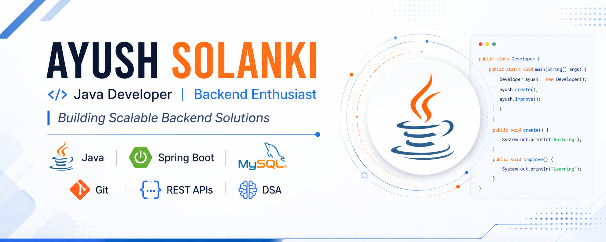

  

<h1 align="center">Hi 👋, I'm Ayush Solanki Welcome to My GitHub Profile</h1>

  <h3 align="center">
Java Developer | Backend Enthusiast | DSA Problem Solver
</h3>

  

  

---

## 🚀 About Me

🎓 MSc Computer Science & Information Technology Student at JAIN University

💻 Passionate about Software Development and Backend Engineering

🌱 Currently Learning

- Spring Boot
- REST APIs
- Backend Development

🧠 Strong Foundation In

- Java
- OOP
- Data Structures & Algorithms
- MySQL
- Git & GitHub

📍 Bengaluru, India

---

## 🛠 Tech Stack

---

## 🚀 Featured Projects

### 🧩 Sudoku Solver
A Java application that solves Sudoku puzzles using the Backtracking Algorithm.

**Tech Stack:** Java, Recursion, DSA

🔗 https://github.com/justayush18/sudoku-solver-java

---

### 🌐 Friendship Graph Network
A graph-based social network simulator that models relationships and network connections between users.

**Tech Stack:** Java, Graphs, DSA

🔗 https://github.com/justayush18/friendship-graph-network

---

### 📚 DSA Java Codes
A collection of Data Structures and Algorithms implementations and coding practice solutions.

**Tech Stack:** Java, DSA

🔗 https://github.com/justayush18/DsaJavaCodes

---

### ☕ Basic Java Codes
Core Java concepts, OOP examples, loops, arrays, methods, and beginner-friendly programs.

**Tech Stack:** Java

🔗 https://github.com/justayush18/BasicJavaCodes

---

## 📈 GitHub Analytics

  
  

---

## 🔥 Contribution Streak

  

---

## 🎯 Current Focus

✔ Mastering Data Structures & Algorithms

✔ Building Spring Boot Projects

✔ Learning REST API Development

✔ Preparing for Software Development Internships

---

## 🤝 Connect With Me

📧 Email: solayush01@gmail.com

💼 LinkedIn:
https://www.linkedin.com/in/ayush-solanki-454b29361/

🐙 GitHub:
https://github.com/justayush18
